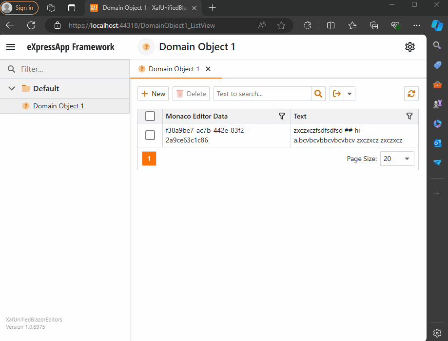
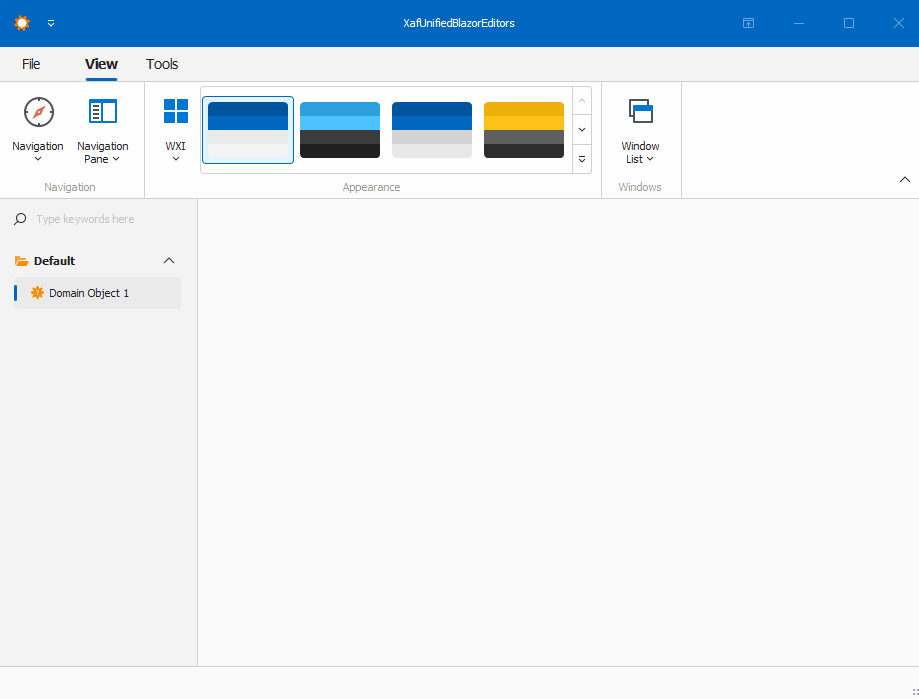

# XafUnifiedBlazorEditors

This repo demonstrates how to use Monaco Editor in XAF Blazor and WinForms applications.The idea is to have
a unified editor for both platforms.

 

Full article here : [Unified Monaco Editor in XAF Blazor and WinForms](https://www.jocheojeda.com/2024/07/28/creating-xaf-pro…or-using-webview/)

